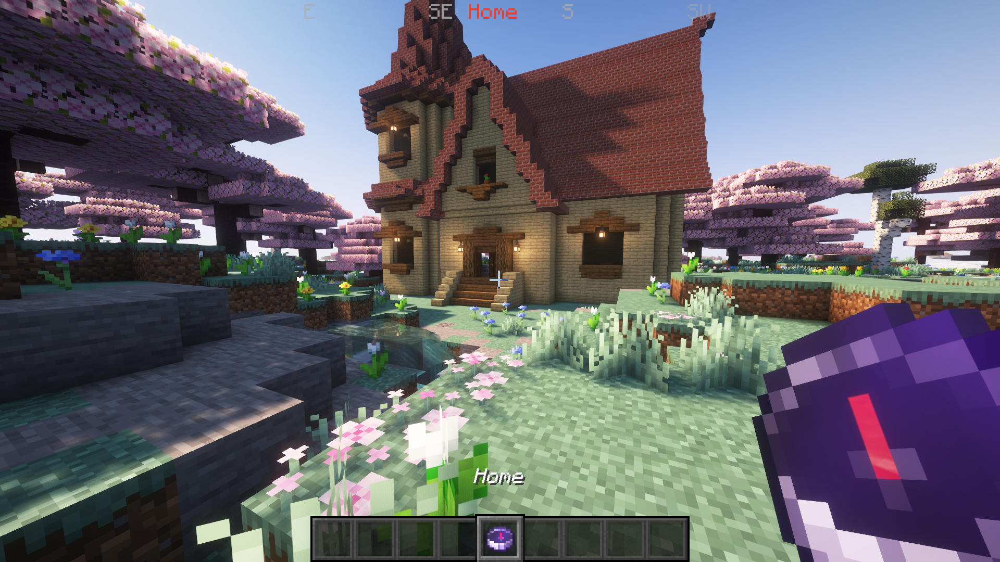
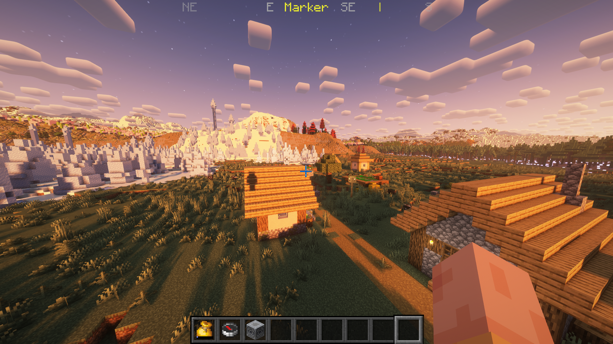

# Hud Compass Mod

A simple RPG-style HUD compass for Minecraft (Fabric).

> **Disclaimer:** This is a personal mod I created for my own use. It's my first mod and likely my last. I probably won't update it in the future, but feel free to modify the code if you're interested.

---

## How It Works

The compass displays the 8 cardinal directions and your last death location by default.

It also supports custom pins using Lodestone Compasses in the inventory.

Additionally, you can store the compasses in a bundle renamed to "Compass Bundle" to keep your inventory tidy.

To add color to the pins, place the compass inside a colored bundle (I couldn't think of a better way to do it).

## Screenshots

